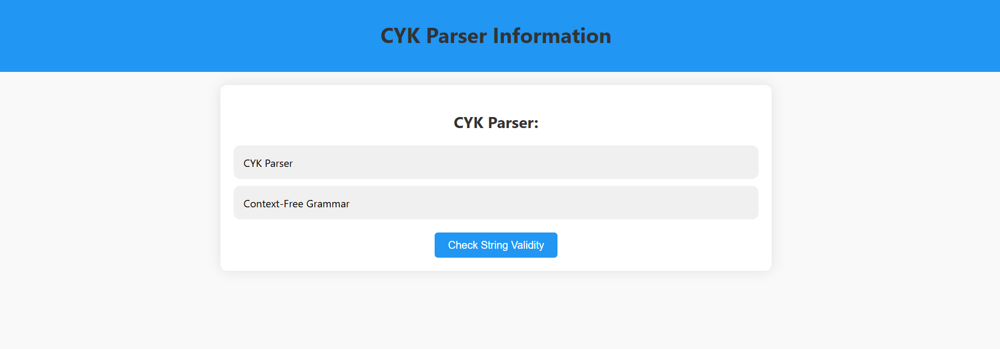

#CYK Parser Website
Overview
This website provides an intuitive interface to learn about the CYK (Cocke-Younger-Kasami) Parser, its functionality, and related concepts like Context-Free Grammar (CFG). It explains key terminologies and methodologies used in parsing strings with context-free grammars.

Features
Interactive Information: Clickable tags that display information about the CYK Parser and CFGs.
Modern Design: Responsive and user-friendly UI for seamless navigation.
Easy Navigation: A button to navigate back to the main page (main.html).
Technologies Used
HTML5: For structuring the website.
CSS3: For styling and making the page visually appealing.
JavaScript: For interactive functionalities, such as displaying information dynamically.

# CYK PARSER Website Screenshots

## Homepage

## Features Page

## Checking String Validity Page

